# DevHelper for Ruby on Rails

DevHelper for Ruby on Rails is an open source AI-based development assistant for Rails developers

This project is inspired by various projects including open-interpreter which astounded me with the numerous possible application of LLMs to various tasks.

This simple chat script assumes that you have oobabooga or an OpenAI compatible API at the end point defined in the url in main.py.

The model I found most simple to work with was the [Nous Hermes II](https://huggingface.co/bartowski/Hermes-2-Pro-Llama-3-8B-exl2/tree/8_0), other models might perform as well.

Important notes:

- to limit the chaos involved I forced temperature to 0
- to have some reference for determinisim I set some seed

# How this works

- This script simply takes your general description of an application that you would like written in Rails.
- It asks the LLM to list the files that it thinks it would need to write to achieve your request
- The file list it generates is stored and then fed to the LLM to be written one at a time
- each file that is written is passed through a linter for a basic sanity check, if it fails, the LLM is asked to review the linter output and re-write the code
- once all files have been created, the script pauses and a new phase of the development effort is at hand
  ...(to be continued)

Usage:

```
python3 -u main.py
```

## Starting a new project:

Simply start DevHelper and describe the project or application you want. It will then proceed to list the files that it will write and then write them.

If you have a project description, put it in a file and use the create instruction to make the LLM read it and plan the files to write:

```
%create /app/myapp/project.md mycoolapp
```

- This should get the LLM to create an app_files json which will then be processed by the script and the LLM will be directed to create each file in sequence.
- mycoolapp will be used to replace example texts in the llm instructions to ensure the LLM does not diverge unnecessarily.

## Resuming or modifying an existing project:

start the script and the enter the following:

```
%resume /app/folder/ mycoolapp
```

- This will simply load all the code files in that folder (erb,rb,html) (from app_files.json) and provide it to the LLM for review.

```
%update _describe your update request here_
```

- Must be run after a resume command is provided first, this will instruct the LLM to explain how it intends to do the change you request. And then guides it through doing that.

```
%diagnose _error message_
```

- Must be run after a resume command is provided first, this will instruct the LLM to diagnose an error by first describing which files it thinks are related to the error. The specified files' contents are loaded and provided to the LLM, after which it is asked to put a plan for fixing the error, and provide a list of files that need to be updated/created to fix the error. After this the logic from the udpate command takes over.

# Docker

The Dockerfile should build an image capable of running this code and starting a rails server...

# Logic

The following Mermaid Process Diagram summarizes the current layout of the code.

```mermaid
stateDiagram-v2
    [*] --> USER_INPUT
    USER_INPUT --> CREATE
    USER_INPUT --> RESUME
    USER_INPUT --> UPDATE
    CREATE -->  CREATE_INSTRUCTIONS
    CREATE_INSTRUCTIONS --> CREATE_CREATE_INSTRUCTIONS
    CREATE_CREATE_INSTRUCTIONS --> CREATE_SEND_DESCRIPTION_TO_LLM
    CREATE_SEND_DESCRIPTION_TO_LLM --> SEND_TO_LLM
    SEND_TO_LLM --> RECEIVE_RESPONSE
    RECEIVE_RESPONSE --> CREATE_APP_FILES
    CREATE_APP_FILES --> CREATE_STORE_APP_FILES
    CREATE_STORE_APP_FILES --> UPDATE_FILE_QUEUE
    UPDATE_FILE_QUEUE --> CREATE_INSTRUCTIONS
    CREATE_INSTRUCTIONS --> FILE_QUEUE_NOT_EMPTY
    FILE_QUEUE_NOT_EMPTY --> POP_FILE_FROM_QUEUE
    POP_FILE_FROM_QUEUE --> CREATE_NEXT_FILE_WRITE_INSTRUCTIONS
    CREATE_NEXT_FILE_WRITE_INSTRUCTIONS --> SEND_WRITE_INSTRUCTIONS_TO_LLM
    SEND_WRITE_INSTRUCTIONS_TO_LLM --> SEND_TO_LLM
    RECEIVE_RESPONSE --> RECEIVE_CODE_RESPONSE
    RECEIVE_CODE_RESPONSE --> SCAN_CODE_FILE
    SCAN_CODE_FILE --> CLEAN_CODE
    CLEAN_CODE --> CREATE_NEXT_FILE_WRITE_INSTRUCTIONS
    SCAN_CODE_FILE --> BUGGY_CODE
    BUGGY_CODE --> CREATE_INSTRUCTIONS
    CREATE_INSTRUCTIONS --> REPORT_BUG_AND_CODE_FOR_LLM
    REPORT_BUG_AND_CODE_FOR_LLM --> SEND_TO_LLM
    CREATE_INSTRUCTIONS --> FILE_QUEUE_EMPTY
    FILE_QUEUE_EMPTY --> USER_INPUT
    RESUME --> RESUME_LOAD_CODE_AND_DESCRIPTION
    RESUME_LOAD_CODE_AND_DESCRIPTION --> CREATE_INSTRUCTIONS
    CREATE_INSTRUCTIONS --> RESUME_INSTRUCTIONS
    RESUME_INSTRUCTIONS --> RESUME_SEND_PROJECT_DESCRIPTION_AND_CODE_TO_LLM
    RESUME_SEND_PROJECT_DESCRIPTION_AND_CODE_TO_LLM --> SEND_TO_LLM
    RECEIVE_RESPONSE --> RESUME_LLM_CONFIRMS_PROJECT_DESCRIPTION
    RESUME_LLM_CONFIRMS_PROJECT_DESCRIPTION --> USER_INPUT
    USER_INPUT --> UPDATE
    UPDATE --> CREATE_INSTRUCTIONS
    CREATE_INSTRUCTIONS --> UPDATE_ASK_LLM_FOR_UPDATE_PLAN
    UPDATE_ASK_LLM_FOR_UPDATE_PLAN --> SEND_REQUEST_FOR_UPDATE_PLAN
    SEND_REQUEST_FOR_UPDATE_PLAN --> SEND_TO_LLM
    RECEIVE_RESPONSE --> UPDATE_LLM_UPDATE_PLAN
    UPDATE_LLM_UPDATE_PLAN --> CREATE_INSTRUCTIONS
    CREATE_INSTRUCTIONS --> UPDATE_ASK_LLM_FOR_FILES_TO_UPDATE
    UPDATE_ASK_LLM_FOR_FILES_TO_UPDATE --> UPDATE_SEND_REQEUEST_FOR_FILE_UPDATE_QUEUE
    UPDATE_SEND_REQEUEST_FOR_FILE_UPDATE_QUEUE --> SEND_TO_LLM
    RECEIVE_RESPONSE --> UPDATE_LLM_FILES_TO_UPDATE
    UPDATE_LLM_FILES_TO_UPDATE --> UPDATE_FILE_QUEUE
    DIAGNOSE --> CREATE_INSTRUCTIONS
    CREATE_INSTRUCTIONS --> DIAGNOSE_ASK_LLM_TO_LIST_ERROR_RELATED_FILES
    DIAGNOSE_ASK_LLM_TO_LIST_ERROR_RELATED_FILES --> DIAGNOSE_SEND_REQUEST_FOR_ERROR_RELATED_FILES
    DIAGNOSE_SEND_REQUEST_FOR_ERROR_RELATED_FILES --> SEND_TO_LLM
    RECEIVE_RESPONSE --> DIAGNOSE_LLM_TASK_FILES
    DIAGNOSE_LLM_TASK_FILES --> DIAGNOSE_LOAD_CODE_IN_TASK_RELEVANT_CODE_STORE
    DIAGNOSE_LOAD_CODE_IN_TASK_RELEVANT_CODE_STORE --> CREATE_INSTRUCTIONS
    CREATE_INSTRUCTIONS --> DIAGNOSE_ASK_LLM_TO_READ_TASK_RELATED_CODE_AND_PROVIDE_UPDATE_PLAN
    DIAGNOSE_ASK_LLM_TO_READ_TASK_RELATED_CODE_AND_PROVIDE_UPDATE_PLAN --> SEND_REQUEST_FOR_UPDATE_PLAN
```



# Further Exploration Plan

So this experiment started out to explore how easy it would be to make a workable useful dev assistant.

The following are some of the challenges I've noted:

- how well your instructions are followed is quite dependent on the model
- it is not clear to me at the moment how system vs user roles are expected to function. I've noted that some messages are ignored if I choose one role over the other, I am not too aware of the underlying training data and how those to are supposed to play together in the context provided to the LLM.
- The first version of this code that is somewhat functional, is a bit shallow in that it may not guarantee a full consistency in the output because the context window is kept artificially small and I do not pass on the entire history back to the LLM.
  - a few remedies come to mind:
    - define the concept of an epic that contains an overarching goal that the user states (this is basically the %create command but with some more context maintained around the conversation with the LLM.) Here we need to not only maintain the epic's description across the conversation but perhaps also a type of iterator that states where we are within the epic. The main reference point at the moment used is the list of files that the LLM is asked to specify upfront to implement whatever the epic description is. As each file is created, we bump the iterator, keep the epic description and tell the model to create the next file.
    - obviously some context is missing in that the file it just wrote is now no longer considered when writing the next file...this could potentially result in odd logic, where something was assumed in one file and the next file is written with a reverse assumption that the first file had handled it. Therefore it is important to consider adding a code context window, where we either maintain within the conversation body going back and forths the code written by the LLM for each file...or simply a summary of that code. The reason I think a summary might be better, is because I'm noticing that the more code you put into the conversation, the more the model feel statistically inclined to only address the code and perform what looks like completions and whacky divergence.
- it is important also to consider resume vs creation logic. These are somewhat disjunct and need to be better managed with a sort of tapered process. I am still working through this logic in my mind. Latest version and diagram see to better manage this..
- one issue is that I cannot seem to keep the LLM responses sane if I put too much code into the context window...the latest code tries to keep 2 main messages that present the state back to the LLM. The Epic, which describes the project, and the directive, which communicates to the LLM what to do next. If I try to squeeze the entire source code into the epic blob things get totally out of whack.

## TODO

- stop repeated attempts to fix buggy code that don't lead to a successful scan after 3 attempts and give user option to assist the assistant
- update logic should follow diagnose approach, read to model the relevant files only and not everything so as to keep from diverging
- make LLM build test cases and run them to fix bugs earlier
